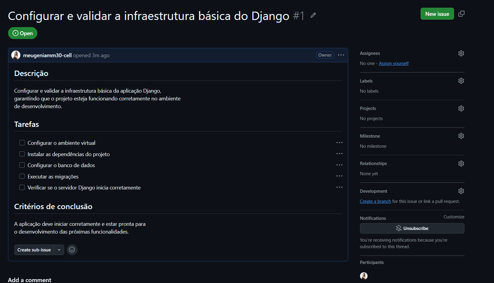

# ESG dentro das E-commerces (nome a definir)

## Sobre nosso projeto

Este projeto tem como objetivo ressignificar a importância das práticas de ESG
para pequenas e médias empresas que atuam no comércio eletrônico.

A proposta é tornar o ESG mais simples e acessível para os pequenos
e-commerces, mostrando como práticas ambientais, sociais e de governança podem
ser aplicadas no dia a dia e contribuir para o desenvolvimento do negócio.

---

## Tecnologias Utilizadas

- Python
- Django
- Git e GitHub

---
## Ferramentas Utilizadas

- Visual Studio Code
- GitHub

# Entregas

## Entrega 01 — Análise de Concorrentes

Nesta primeira entrega foi realizada uma análise de soluções existentes
relacionadas a ESG, sustentabilidade e e-commerce.

Foram analisados cinco concorrentes:

- Mangue Tech
- Carbonova
- Sebrae — Crescimento Sustentável
- Paresi
- Jornada da Sustentabilidade

A análise considera o funcionamento de cada solução, seus pontos fortes e
pontos fracos, além de um benchmark comparativo.

### Artefatos

- [Análise completa de concorrentes](Analise_de competidores.md)
- [Benchmark](https://i.ibb.co/Ng0vSX9V/benchmarking-esg-ecommerce-full-hd.png)

### Screenshots

  
  
  

  
  
  

  

---

# Equipe

| Nome | E-mail School | 
Ana Júlia de Melo Costa  ajmcs2@cesar.school 
Arthur Marenga Paranhos  amp4@cesar.school 
Daniel Santana Bezerra   dsb3@cesar.school 
José Victor Telles de Araujo Pereira Tavares   Jvtapt@cesar.school 
Maria Eugênia Mateus Moraes  memm@cesar.school 
Marcos Luiz Galdino Berto Alves mlgba@cesar.school

---
## Issue/Bug Tracker

O projeto utiliza o Issue Tracker do GitHub para registrar,
acompanhar e organizar tarefas e possíveis bugs encontrados
durante o desenvolvimento.

### Issue de acompanhamento

https://victor0609.atlassian.net/jira/software/projects/KAN/boards/1/backlog?selectedIssue=KAN-16&atlOrigin=eyJpIjoiYThiYTMzYjdlZDE4NDdmZDhkNWNlNmQ0MjZiMGEwNmEiLCJwIjoiaiJ9

## Link da apresentação do site

https://youtu.be/cuc5XAlUUAI?is=H_MAsDdn_2Gf-QeC
